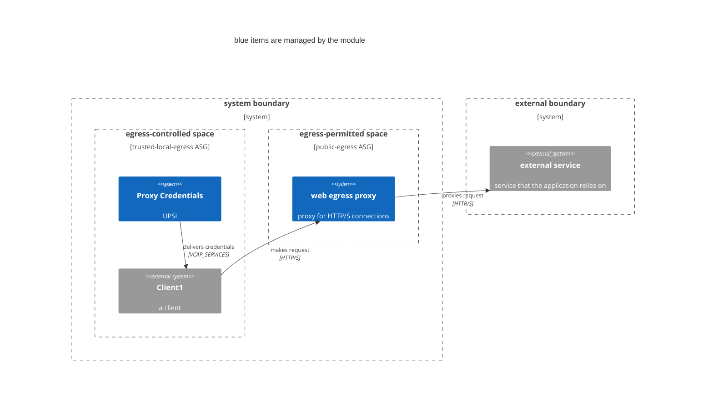

# cg-supabase

A terraform module that manages a Supabase deployment on cloud.gov

## Why this project

Your project probably needs a backend and a DB, and you probably want to avoid writing custom code wherever you can. 

[Supabase is a collection of open source components](https://github.com/supabase/supabase?tab=readme-ov-file#how-it-works) that together provide a featureful and secure backend that is customized directly from the schema and content of a Postgres database. It has a nice UI and DX for using all of its features, including schema migration. See [Supabase's documentation](https://supabase.com/docs) for more information.

This module deploys Supabase on cloud.gov, providing a compliance- and production-oriented backend that you can use immediately. 

## Usage
```terraform
module "supabase" {
  source            = "../path/to/source"
  cf_org_name       = var.cf_org_name
  cf_space_name     = var.cf_space_name
  https_proxy       = module.https-proxy.https_proxy
  s3_id             = module.s3-private.bucket_id
  logdrain_id       = module.cg-logshipper.logdrain_service_id

  jwt_secret       = var.jwt_secret
  anon_key         = var.anon_key
  service_role_key = var.service_role_key

  database_plan         = "micro-psql"
  rest_instances        = 1
  storage_instances     = 1
  disk_quota            = #
}
```

<!-- 
## Deployment architecture


1. Creates an egress proxy in the designated space
2. Adds network-policies so that clients can reach the proxy
3. Creates a user-provided service instance in the client space with credentials
 -->

## STATUS

- `rest`, `studio`, and `storage` are deploying
    - `rest` seems to work fine
    - `studio` runs without crashing, but gets errors whenever you try to run an SQL query
        - This will probably work now that we have `postgres-meta` running, but we can't auth yet
    - `storage` tries to run database migrations, but fails because there is no `postgres` role
        - 👆 I think this is also why `studio` isn't working

## Docker Compose Development Environment

### Quick Start

**For Development (recommended):**
```bash
# Review DEVELOPMENT.md for setup instructions
cd docker
docker compose -f docker-compose.yml -f ./dev/docker-compose.dev.yml up -d
chmod +x test_supabase_health.sh
./test_supabase_health.sh
```

**For Production-like Testing:**
```bash
cd docker
docker compose up -d
chmod +x test_supabase_health.sh
./test_supabase_health.sh
```

### Database Initialization

The Supabase stack uses several database initialization scripts that are automatically applied when the database container is first created:

**Core Supabase Infrastructure** (`docker/volumes/db/`):
- `_supabase.sql` - Creates the `_supabase` database for analytics
- `logs.sql` - Creates the `_analytics` schema for Logflare analytics 
- `roles.sql` - Sets up database roles and passwords
- `jwt.sql` - Configures JWT settings
- `webhooks.sql` - Sets up webhook functionality
- `realtime.sql` - Configures realtime subscriptions
- `pooler.sql` - Sets up connection pooling
- `debug_manual_fixes.sql` - Manual fixes for common setup issues

**Development Seed Data** (`docker/dev/`):
- `data.sql` - Contains sample tables, policies, and data for development

**Key Differences:**
- **Development mode** (`-f ./dev/docker-compose.dev.yml`): Includes sample data, mail testing server, and development-optimized settings
- **Production mode** (default): Only core infrastructure, no sample data, production-oriented configuration

### File Permissions Setup

**Important:** Docker containers need proper file permissions to read initialization scripts:

```bash
# Set proper permissions on all initialization files
cd docker
chmod 644 volumes/db/*.sql
chmod 644 dev/*.sql
chmod -R 755 volumes/
```

### Setup Commands

**Fresh Installation:**
```bash
cd docker
# Ensure proper permissions
chmod 644 volumes/db/*.sql dev/*.sql
chmod -R 755 volumes/

# Start with development overlay
docker compose -f docker-compose.yml -f dev/docker-compose.dev.yml up -d

# Check status
../test_supabase_health.sh
```

**Clean Restart (removes all data):**
```bash
cd docker
docker compose down -v  # Removes volumes and networks
chmod 644 volumes/db/*.sql dev/*.sql  # Reset permissions
docker compose -f docker-compose.yml -f dev/docker-compose.dev.yml up -d
```

### Service URLs

When running, services are accessible at:

- **Supabase Studio**: http://localhost:8082 (Web interface for database management)
- **API Gateway (Kong)**: http://localhost:8000 (All API endpoints)
- **Meta API**: http://localhost:5555 (Database metadata)
- **Analytics (Logflare)**: http://localhost:4000 (Logging dashboard)
- **Mail Interface**: http://localhost:9000 (Email testing)

## Debug and Troubleshooting

### Common Issues and Solutions

#### 1. Container Permission Errors

**Symptoms:** Containers fail to start with permission denied errors
```bash
# Fix file permissions
cd docker
chmod 644 volumes/db/*.sql dev/*.sql
chmod -R 755 volumes/ dev/
docker compose restart
```

#### 2. Database Authentication Failures

**Symptoms:** Services can't connect to database, password authentication failed
```bash
# Run manual database fixes
cd docker
docker exec -e PGPASSWORD=postgres supabase-db psql -U postgres -f /docker-entrypoint-initdb.d/debug_manual_fixes.sql
# Or manually fix passwords
docker exec -e PGPASSWORD=postgres supabase-db psql -U postgres -c "
ALTER USER supabase_auth_admin PASSWORD 'your-super-secret-and-long-postgres-password';
ALTER USER supabase_storage_admin PASSWORD 'your-super-secret-and-long-postgres-password';
"
```

#### 3. Missing Database Schemas

**Symptoms:** Auth or realtime services failing with "schema does not exist"
```bash
# Create missing schemas manually
docker exec -e PGPASSWORD=postgres supabase-db psql -U postgres -c "
DROP SCHEMA IF EXISTS auth CASCADE;
CREATE SCHEMA auth;
GRANT USAGE ON SCHEMA auth TO postgres, anon, authenticated, service_role, supabase_auth_admin;
GRANT CREATE ON SCHEMA auth TO supabase_auth_admin;
"

# Create realtime schema
docker exec -e PGPASSWORD=postgres supabase-db psql -U postgres -c "
CREATE SCHEMA IF NOT EXISTS realtime;
GRANT USAGE ON SCHEMA realtime TO postgres, anon, authenticated, service_role;
"

# Restart affected services
docker restart supabase-auth realtime-dev.supabase-realtime
```

#### 4. Analytics Database Missing

**Symptoms:** Analytics service fails, "_supabase database does not exist"
```bash
# Create analytics database and schema
docker exec -e PGPASSWORD=postgres supabase-db psql -U postgres -c "
CREATE DATABASE _supabase;
"
docker exec -e PGPASSWORD=postgres supabase-db psql -U postgres -d _supabase -c "
CREATE SCHEMA IF NOT EXISTS _analytics;
"
docker restart supabase-analytics
```

#### 5. Kong Configuration File Access

**Symptoms:** Kong failing with "can't open temp.yml: Permission denied"
```bash
# Fix Kong configuration permissions
cd docker
chmod -R 755 volumes/
find volumes/ -type f -exec chmod 644 {} \;
docker restart supabase-kong
```

### Debug Commands

**Check container status:**
```bash
docker ps --format "table {{.Names}}\t{{.Status}}\t{{.Ports}}"
```

**View service logs:**
```bash
docker logs supabase-auth
docker logs supabase-kong  
docker logs supabase-db
docker logs supabase-analytics
```

**Connect to database:**
```bash
docker exec -e PGPASSWORD=postgres -it supabase-db psql -U postgres
```

**Run health check:**
```bash
cd /path/to/cg-supabase
./test_supabase_health.sh
```

**Manual SQL fixes (if automatic initialization fails):**
```bash
# Run comprehensive debug script
docker exec -e PGPASSWORD=postgres supabase-db psql -U postgres -f /docker-entrypoint-initdb.d/debug_manual_fixes.sql
```

### Expected HTTP Status Codes

When testing endpoints, these responses are **normal**:
- **HTTP 401 (Unauthorized)**: API endpoints require authentication keys
- **HTTP 400 (Bad Request)**: Some endpoints need specific headers  
- **HTTP 404 (Not Found)**: Some health check endpoints don't exist
- **HTTP 200 (OK)**: Successful responses

Only **connection failures** and **500 errors** indicate actual problems.
## TODO

- Deploy Kong as the API gateway in front of everything else
- Allow injection of the bucket and postgres db in place of the module creating/managing them itself
- Uncomment the `Deployment Architecture` section in this doc and make the diagram accurate

## Contributing

See [CONTRIBUTING](CONTRIBUTING.md) for additional information.

## Public domain

This project is in the worldwide [public domain](LICENSE.md). As stated in [CONTRIBUTING](CONTRIBUTING.md):

> This project is in the public domain within the United States, and copyright and related rights in the work worldwide are waived through the [CC0 1.0 Universal public domain dedication](https://creativecommons.org/publicdomain/zero/1.0/).
>
> All contributions to this project will be released under the CC0 dedication. By submitting a pull request, you are agreeing to comply with this waiver of copyright interest.
