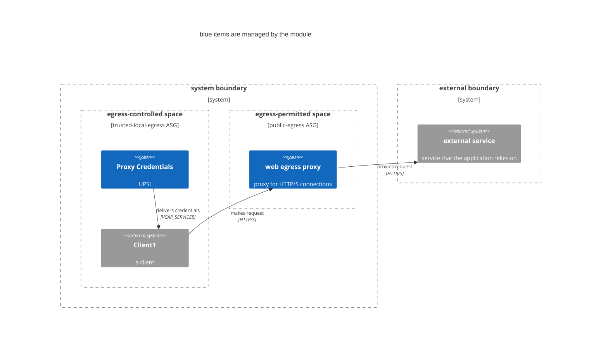

# cg-supabase

A terraform module that manages a Supabase deployment on cloud.gov

## Why this project

Your project probably needs a backend and a DB, and you probably want to avoid writing custom code wherever you can. 

[Supabase is a collection of open source components](https://github.com/supabase/supabase?tab=readme-ov-file#how-it-works) that together provide a featureful and secure backend that is customized directly from the schema and content of a Postgres database. It has a nice UI and DX for using all of its features, including schema migration. See [Supabase's documentation](https://supabase.com/docs) for more information.

This module deploys Supabase on cloud.gov, providing a compliance- and production-oriented backend that you can use immediately. 

## Usage
```terraform
module "supabase" {
  source            = "../path/to/source"
  cf_org_name       = var.cf_org_name
  cf_space_name     = var.cf_space_name
  https_proxy       = module.https-proxy.https_proxy
  s3_id             = module.s3-private.bucket_id
  logdrain_id       = module.cg-logshipper.logdrain_service_id

  jwt_secret       = var.jwt_secret
  anon_key         = var.anon_key
  service_role_key = var.service_role_key

  database_plan         = "micro-psql"
  rest_instances        = 1
  storage_instances     = 1
  disk_quota            = #
}
```

<!-- 
## Deployment architecture


1. Creates an egress proxy in the designated space
2. Adds network-policies so that clients can reach the proxy
3. Creates a user-provided service instance in the client space with credentials
 -->

## STATUS

- `rest`, `studio`, and `storage` are deploying
    - `rest` seems to work fine
    - `studio` runs without crashing, but gets errors whenever you try to run an SQL query
        - This will probably work now that we have `postgres-meta` running, but we can't auth yet
    - `storage` tries to run database migrations, but fails because there is no `postgres` role
        - 👆 I think this is also why `studio` isn't working

## TODO

- Deploy Kong as the API gateway in front of everything else
- Allow injection of the bucket and postgres db in place of the module creating/managing them itself
- Uncomment the `Deployment Architecture` section in this doc and make the diagram accurate

## Contributing

See [CONTRIBUTING](CONTRIBUTING.md) for additional information.

## Public domain

This project is in the worldwide [public domain](LICENSE.md). As stated in [CONTRIBUTING](CONTRIBUTING.md):

> This project is in the public domain within the United States, and copyright and related rights in the work worldwide are waived through the [CC0 1.0 Universal public domain dedication](https://creativecommons.org/publicdomain/zero/1.0/).
>
> All contributions to this project will be released under the CC0 dedication. By submitting a pull request, you are agreeing to comply with this waiver of copyright interest.
