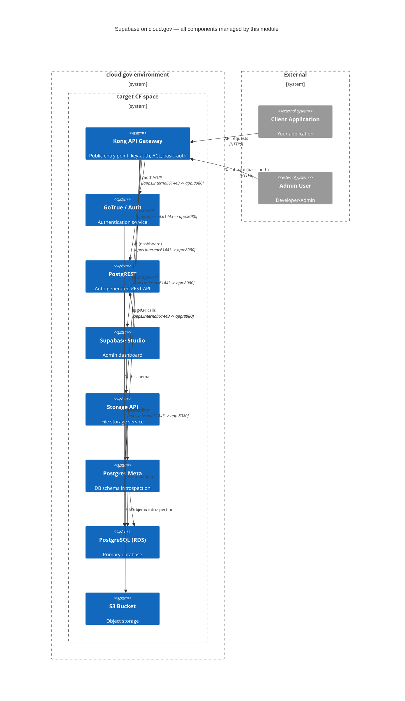

# cg-supabase

A terraform module that manages a Supabase deployment on cloud.gov

## Why this project

Your project probably needs a backend and a DB, and you probably want to avoid writing custom code wherever you can. 

[Supabase is a collection of open source components](https://github.com/supabase/supabase?tab=readme-ov-file#how-it-works) that together provide a featureful and secure backend that is customized directly from the schema and content of a Postgres database. It has a nice UI and DX for using all of its features, including schema migration. See [Supabase's documentation](https://supabase.com/docs) for more information.

This module deploys Supabase on cloud.gov, providing a compliance- and production-oriented backend that you can use immediately. 

## Usage
```terraform
module "supabase" {
  source        = "../path/to/source"
  cf_org_name   = var.cf_org_name
  cf_space_name = var.cf_space_name

  # JWT secrets are optional — omit to auto-generate via camptocamp/jwt provider.
  # jwt_secret       = var.jwt_secret
  # anon_key         = var.anon_key
  # service_role_key = var.service_role_key

  database_plan = "micro-psql"
  s3_plan_name  = "basic"

  api_instances     = 1
  meta_instances    = 1
  rest_instances    = 1
  storage_instances = 1
  studio_instances  = 1
}
```

See `vars.auto.tfvars-example` for the full set of options, including service-account credentials, username/password credentials, or CF CLI config fallback after `cf login --sso`.

After `terraform apply`, retrieve the auto-generated Studio password with:
```bash
terraform output -raw dashboard_password
```

## Deployment architecture

All services run in a single Cloud Foundry space on cloud.gov.  Kong is the
only publicly-routed app; backend services communicate over private CF internal
routes (`apps.internal`) on port 61443. Cloud Foundry's platform-managed c2c TLS
proxy maps port 61443 to app port 8080, so every backend service is configured
to listen on 8080.


```mermaid
    C4Context
      title Supabase on cloud.gov — all components managed by this module

      Boundary(cloudgov, "cloud.gov environment") {
          Boundary(target_space, "target CF space") {
            System(kong, "Kong API Gateway", "Public entry point: key-auth, ACL, basic-auth")
            System(auth, "GoTrue / Auth", "Authentication service")
            System(rest, "PostgREST", "Auto-generated REST API")
            System(studio, "Supabase Studio", "Admin dashboard")
            System(storage, "Storage API", "File storage service")
            System(meta, "Postgres Meta", "DB schema introspection")
            System(postgres_db, "PostgreSQL (RDS)", "Primary database")
            System(s3_bucket, "S3 Bucket", "Object storage")
          }
      }

      Boundary(external, "External") {
        System_Ext(client_app, "Client Application", "Your application")
        System_Ext(admin_user, "Admin User", "Developer/Admin")
      }

      Rel(client_app, kong, "API requests", "HTTPS")
      Rel(admin_user, kong, "Dashboard (basic-auth)", "HTTPS")
      Rel(kong, auth, "/auth/v1/*", "apps.internal:61443 -> app:8080")
      Rel(kong, rest, "/rest/v1/*", "apps.internal:61443 -> app:8080")
      Rel(kong, storage, "/storage/v1/*", "apps.internal:61443 -> app:8080")
      Rel(kong, meta, "/pg/*", "apps.internal:61443 -> app:8080")
      Rel(kong, studio, "/* (dashboard)", "apps.internal:61443 -> app:8080")
      Rel(rest, postgres_db, "Queries")
      Rel(auth, postgres_db, "Auth schema")
      Rel(storage, postgres_db, "File metadata")
      Rel(storage, s3_bucket, "File objects")
      Rel(meta, postgres_db, "Schema introspection")
      Rel(studio, rest, "SSR API calls", "apps.internal:61443 -> app:8080")
      Rel(studio, meta, "Table editor", "apps.internal:61443 -> app:8080")
```

**Not deployed by this module** (require platform features unavailable on cloud.gov):
| Service | Reason |
|---|---|
| Realtime | Hardcodes `inet6` socket options; cloud.gov containers lack IPv6 |
| Edge Functions | Not in scope — would require a [cloud.gov egress proxy](https://github.com/GSA-TTS/terraform-cloudgov/tree/main/egress_proxy) for outbound HTTP requests |
| Analytics / Logflare | Not in scope |

## Status

All six services (Kong, GoTrue, PostgREST, Studio, Storage, pg-meta) deploy
and run on cloud.gov.  See `docs/pr-terraform-working-approach.md` for
known limitations and the rationale behind each SSL workaround.

## cloud.gov Smoke Test

A user with access to a cloud.gov org/space can run one command to deploy this module with sandbox-safe sizing, verify the apps and public routes, print a PASS/FAIL report, and destroy the deployment by default:

```bash
CG_ORG=<org> CG_SPACE=<space> ./scripts/cloudgov_smoke_test.sh
```

For PR branches, first run the `Pull, scan, and push Supabase images` workflow on the branch. The workflow publishes branch-scoped GHCR tags like `pr-update-terraform`; the smoke test uses the current branch tag by default. Override with `CG_IMAGE_TAG=<tag>` when testing a different image tag.

The smoke test sets one instance per app, 896 MB total app memory (256 MB Kong plus 128 MB each for auth, meta, rest, storage, and studio), RDS `micro-psql`, and S3 `basic-sandbox` so it fits and works in the default 1 GB cloud.gov sandbox quota. It creates/reuses those backing services with the `cf` CLI before running Terraform, avoiding a `cloudfoundry` provider v1.18.0 managed-service creation crash seen when cloud.gov omits `maintenance_info` from a service response. It also removes stale Terraform-managed backing-service resources from the isolated smoke-test state before apply. It uses isolated Terraform metadata under `.cloudgov-smoke.terraform` and local state at `.cloudgov-smoke.tfstate`, then destroys the deployment by default. If `CG_ORG` and `CG_SPACE` are omitted, the script uses the current `cf target`. If Terraform credentials are not set, the script passes the current `cf oauth-token` to the provider as `CF_ACCESS_TOKEN`. On failure, diagnostics are written under `.cloudgov-smoke-logs/`; set `CG_KEEP_ON_FAILURE=1` or `CG_KEEP_DEPLOYMENT=1` to leave resources running for manual inspection.

## Docker Compose Development Environment

See [DEVELOPMENT.md](DEVELOPMENT.md) for detailed instructions on setting up and using the Docker Compose development environment.

### Updating Secrets

The `.env` file in the `docker/` directory contains environment variables required for the Docker Compose setup. This file holds sensitive data such as database passwords, API keys, and service credentials. **Always update these values before running in production, and rerun Docker Compose to apply any changes.**

**Key variables to configure:**

- `POSTGRES_PASSWORD`: Password for the `postgres` database role.
- `JWT_SECRET`: Secret used by PostgREST, GoTrue, and other services for authentication.
- `SITE_URL`: The base URL of your deployment.
- `SMTP_*`: Credentials for your SMTP mail server (can use any SMTP provider).
- `POOLER_TENANT_ID`: Tenant ID for the Supavisor pooler in your connection string.

After updating any values, restart the relevant services for changes to take effect.

#### Dashboard Authentication

The Supabase Dashboard is protected with basic authentication. **You must change the default credentials before using in production.** Update these values in `docker/.env`:

- `DASHBOARD_USERNAME`: Username for Dashboard login.
- `DASHBOARD_PASSWORD`: Password for Dashboard login.

**Note:** Restart Docker Compose after making changes to the `.env` file to ensure all services pick up the new configuration.

### Database Initialization

The Supabase stack uses several database initialization scripts that are automatically applied when the database container is first created:

**Core Supabase Infrastructure** (`docker/volumes/db/`):
- `_supabase.sql` - Creates the `_supabase` database for analytics
- `logs.sql` - Creates the `_analytics` schema for Logflare analytics 
- `roles.sql` - Sets up database roles and passwords
- `jwt.sql` - Configures JWT settings
- `webhooks.sql` - Sets up webhook functionality
- `realtime.sql` - Configures realtime subscriptions
- `pooler.sql` - Sets up connection pooling
- `debug_manual_fixes.sql` - Manual fixes for common setup issues

**Development Seed Data** (`docker/dev/`):
- `data.sql` - Contains sample tables, policies, and data for development

## Contributing

See [CONTRIBUTING](CONTRIBUTING.md) for additional information.

## Public domain

This project is in the worldwide [public domain](LICENSE.md). As stated in [CONTRIBUTING](CONTRIBUTING.md):

> This project is in the public domain within the United States, and copyright and related rights in the work worldwide are waived through the [CC0 1.0 Universal public domain dedication](https://creativecommons.org/publicdomain/zero/1.0/).
>
> All contributions to this project will be released under the CC0 dedication. By submitting a pull request, you are agreeing to comply with this waiver of copyright interest.
