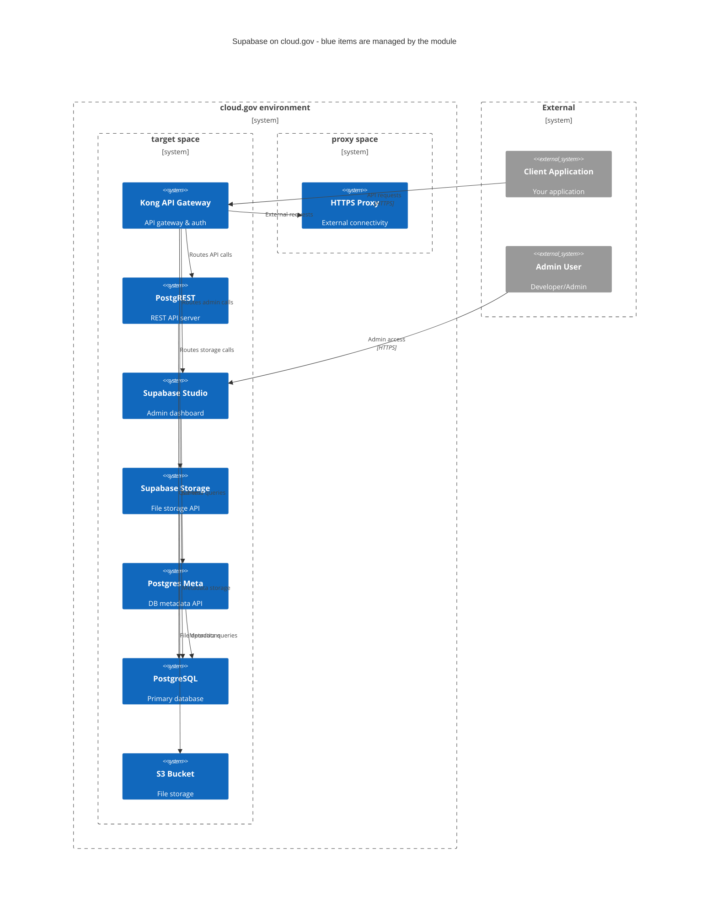

# cg-supabase

A terraform module that manages a Supabase deployment on cloud.gov

## Why this project

Your project probably needs a backend and a DB, and you probably want to avoid writing custom code wherever you can. 

[Supabase is a collection of open source components](https://github.com/supabase/supabase?tab=readme-ov-file#how-it-works) that together provide a featureful and secure backend that is customized directly from the schema and content of a Postgres database. It has a nice UI and DX for using all of its features, including schema migration. See [Supabase's documentation](https://supabase.com/docs) for more information.

This module deploys Supabase on cloud.gov, providing a compliance- and production-oriented backend that you can use immediately.

## Setup

```bash
# Install required tools
brew install tfenv
tfenv use v1.12.2

# Install CF CLI if not already installed
# https://docs.cloudfoundry.org/cf-cli/install-go-cli.html

# Login to cloud.gov with SSO
cf login -a api.fr.cloud.gov --sso

# Target your organization and space
cf target -o your-org-name -s your-space-name

# Verify you can access services (troubleshooting step)
cf marketplace

# Method 1: Using terraform.tfvars (Recommended)
cp terraform.tfvars.example terraform.tfvars
# Edit terraform.tfvars with your actual values

# Method 2: Using environment variables
cp .env.template .env
# Edit .env with your actual values
source .env

# Initialize and apply Terraform
terraform init
terraform plan
terraform apply
```

### Authentication Troubleshooting

If you get "Bad credentials" or "token expired" errors:

```bash
# 1. Get a fresh OAuth token
cf oauth-token

# 2. Copy the token output (it should start with "bearer ")
# Example output: bearer eyJqa3UiOiJodHRwczovL3VhYS5mci5jbG91ZC5nb3Y...

# 3. Extract just the JWT part (remove "bearer " prefix) and update .env
# Edit .env and update CF_ACCESS_TOKEN with just the JWT token

# 4. Source the updated environment
source .env

# 5. Verify CF CLI is working
cf services

# 6. Check available database plans
cf marketplace -s aws-rds

# 7. Check available S3 plans  
cf marketplace -s s3
```

**Note**: OAuth tokens expire regularly (usually every 12 hours). You'll need to refresh the token whenever you see authentication errors.

### Alternative Authentication Methods

If username/password doesn't work, you can use a CF token:

1. Get a token: `cf oauth-token`
2. Create a `terraform.tfvars` file with:
```hcl
# Use token instead of username/password
cf_api_url = "https://api.fr.cloud.gov"
export CF_ACCESS_TOKEN="$(cf oauth-token | sed 's/^bearer //')"
```

### Manual Service Provisioning (if needed)

If you need to manually provision services outside of Terraform:

```bash
# Provision PostgreSQL database (optional - Terraform will create this)
cf create-service aws-rds micro-psql supabase-db

# Check service status
cf services
```

## Usage
```terraform
module "supabase" {
  source            = "../path/to/source"
  cf_org_name       = var.cf_org_name
  cf_space_name     = var.cf_space_name
  https_proxy       = module.https-proxy.https_proxy
  s3_id             = module.s3-private.bucket_id
  logdrain_id       = module.cg-logshipper.logdrain_service_id

  jwt_secret       = var.jwt_secret
  anon_key         = var.anon_key
  service_role_key = var.service_role_key

  database_plan         = "micro-psql"
  rest_instances        = 1
  storage_instances     = 1
  disk_quota            = #
}
```

## Deployment architecture


1. Creates an egress proxy in the designated space
2. Adds network-policies so that clients can reach the proxy
3. Creates a user-provided service instance in the client space with credentials

## SETUP

https://docs.cloudfoundry.org/cf-cli/install-go-cli.html

```bash
brew install tfenv
tfenv use v1.12.2
cf login -a api.fr.cloud.gov  --sso
```

## STATUS

- `rest`, `studio`, and `storage` are deploying
    - `rest` seems to work fine
    - `studio` runs without crashing, but gets errors whenever you try to run an SQL query
        - This will probably work now that we have `postgres-meta` running, but we can't auth yet
    - `storage` tries to run database migrations, but fails because there is no `postgres` role
        - 👆 I think this is also why `studio` isn't working

## TODO

- Deploy Kong as the API gateway in front of everything else
- Allow injection of the bucket and postgres db in place of the module creating/managing themself
> All contributions to this project will be released under the CC0 dedication. By submitting a pull request, you are agreeing to comply with this waiver of copyright interest.
