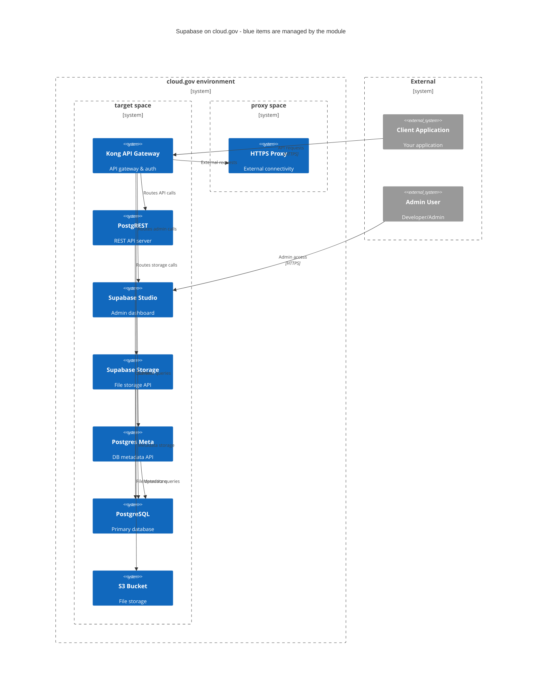

# cg-supabase

A terraform module that manages a Supabase deployment on cloud.gov

## Why this project

Your project probably needs a backend and a DB, and you probably want to avoid writing custom code wherever you can. 

[Supabase is a collection of open source components](https://github.com/supabase/supabase?tab=readme-ov-file#how-it-works) that together provide a featureful and secure backend that is customized directly from the schema and content of a Postgres database. It has a nice UI and DX for using all of its features, including schema migration. See [Supabase's documentation](https://supabase.com/docs) for more information.

This module deploys Supabase on cloud.gov, providing a compliance- and production-oriented backend that you can use immediately. 

## Usage

```terraform
module "supabase" {
  source            = "../path/to/source"
  cf_org_name       = var.cf_org_name
  cf_space_name     = var.cf_space_name
  https_proxy       = module.https-proxy.https_proxy
  s3_id             = module.s3-private.bucket_id
  logdrain_id       = module.cg-logshipper.logdrain_service_id

  jwt_secret       = var.jwt_secret
  anon_key         = var.anon_key
  service_role_key = var.service_role_key

  database_plan         = "micro-psql"
  rest_instances        = 1
  storage_instances     = 1
  disk_quota            = #
}
```

## Deployment architecture



1. Creates an egress proxy in the designated space
2. Adds network-policies so that clients can reach the proxy
3. Creates a user-provided service instance in the client space with credentials

## STATUS

- `rest`, `studio`, and `storage` are deploying
  - `rest` seems to work fine
  - `studio` runs without crashing, but gets errors whenever you try to run an SQL query
    - This will probably work now that we have `postgres-meta` running, but we can't auth yet
  - `storage` tries to run database migrations, but fails because there is no `postgres` role
    - 👆 I think this is also why `studio` isn't working

## Docker Compose Development Environment

### Quick Start

**For Development (recommended):**

Review DEVELOPMENT.md for detailed instructions and troubleshooting

Bring up the environment

```bash
cd docker
cp .env.example .env 
docker compose -f docker-compose.yml -f ./dev/docker-compose.dev.yml up -d
```

Run tests

```bash
../test_supabase_health.sh
```

Stop and remove containers, volumes, and networks

```bash
docker compose -f docker-compose.yml -f ./dev/docker-compose.dev.yml down  
```


### Once running locally

Supabase services will be available at `http://localhost:8082` (Studio), `http://localhost:8000` (API Gateway), and `http://localhost:4000` (Analytics).
Username: supabase
Password: this_password_is_insecure_and_should_be_updated

### Updating Secrets

The `.env` file in the `docker/` directory contains environment variables required for the Docker Compose setup. This file holds sensitive data such as database passwords, API keys, and service credentials. **Always update these values before running in production, and rerun Docker Compose to apply any changes.**

**Key variables to configure:**

- `POSTGRES_PASSWORD`: Password for the `postgres` database role.
- `JWT_SECRET`: Secret used by PostgREST, GoTrue, and other services for authentication.
- `SITE_URL`: The base URL of your deployment.
- `SMTP_*`: Credentials for your SMTP mail server (can use any SMTP provider).
- `POOLER_TENANT_ID`: Tenant ID for the Supavisor pooler in your connection string.

After updating any values, restart the relevant services for changes to take effect.

#### Dashboard Authentication

The Supabase Dashboard is protected with basic authentication. **You must change the default credentials before using in production.** Update these values in `docker/.env`:

- `DASHBOARD_USERNAME`: Username for Dashboard login.
- `DASHBOARD_PASSWORD`: Password for Dashboard login.

**Note:** Restart Docker Compose after making changes to the `.env` file to ensure all services pick up the new configuration.

### Database Initialization

The Supabase stack uses several database initialization scripts that are automatically applied when the database container is first created:

**Core Supabase Infrastructure** (`docker/volumes/db/`):

- `_supabase.sql` - Creates the `_supabase` database for analytics
- `logs.sql` - Creates the `_analytics` schema for Logflare analytics 
- `roles.sql` - Sets up database roles and passwords
- `jwt.sql` - Configures JWT settings
- `webhooks.sql` - Sets up webhook functionality
- `realtime.sql` - Configures realtime subscriptions
- `pooler.sql` - Sets up connection pooling
- `debug_manual_fixes.sql` - Manual fixes for common setup issues

**Development Seed Data** (`docker/dev/`):

- `data.sql` - Contains sample tables, policies, and data for development

## Contributing

See [CONTRIBUTING](CONTRIBUTING.md) for additional information.

## Public domain

This project is in the worldwide [public domain](LICENSE.md). As stated in [CONTRIBUTING](CONTRIBUTING.md):

> This project is in the public domain within the United States, and copyright and related rights in the work worldwide are waived through the [CC0 1.0 Universal public domain dedication](https://creativecommons.org/publicdomain/zero/1.0/).
>
> All contributions to this project will be released under the CC0 dedication. By submitting a pull request, you are agreeing to comply with this waiver of copyright interest.
