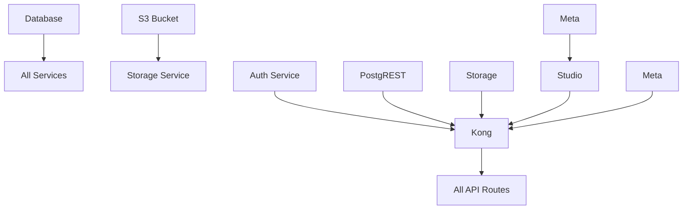

# Terraform Configuration Analysis Report

## Executive Summary

This report analyzes the current state of the cg-supabase Terraform configuration and identifies issues that would prevent a successful `terraform apply`. **Recent fixes have resolved the s3-private module configuration issues.**

## Configuration Structure

```
cg-supabase/
├── main.tf                    # Main module instantiation
├── variables.tf               # Root-level variables
├── providers-managed.tf       # Provider configuration
├── .env                      # Environment variables
├── supabase/                 # Main supabase module
│   ├── supabase.tf           # Core infrastructure
│   ├── variables.tf          # Module variables
│   ├── providers.tf          # Module providers
│   ├── api.tf                # Kong API gateway
│   ├── auth.tf               # Auth service (commented out)
│   ├── rest.tf               # PostgREST service
│   ├── storage.tf            # Storage service
│   ├── studio.tf             # Studio dashboard
│   ├── meta.tf               # Postgres metadata service
│   └── kong/                 # Kong submodule
│       ├── kong.tf
│       ├── variables.tf
│       ├── providers.tf
│       └── outputs.tf
```

## Current Issues Preventing Deployment

### 1. **~~Missing Required Variables~~** ✅ FIXED
- ~~`cf_space_id` is required but not available from current configuration~~ - Now properly defined and passed
- ~~S3 module argument mismatch~~ - Fixed to use correct cf_space_id argument
- Several variables are defined but not properly passed between modules

### 2. **Variable Mismatch Issues** ⚠️ PARTIALLY FIXED
- ~~Root module passes variables that don't exist in supabase module~~ - Fixed
- ~~`cf_space_id` is required but not available from current configuration~~ - Fixed
- External dependencies (https_proxy, s3_id, logdrain_id) are defined but not used

### 3. **Authentication Configuration**
- Auth service is completely commented out in `auth.tf`
- Auth routes in Kong configuration reference non-existent auth service
- Missing auth service breaks the entire API gateway setup

### 4. **Missing Kong Preparation Script**
- Kong module references `prepare-kong.sh` script that doesn't exist
- This would cause Kong deployment to fail

### 5. **Network Policy Issues**
- Network policies reference auth app that isn't deployed
- Missing network policies for some service communications

### 6. **Environment Variable Issues**
- `.env` file has placeholder values that need to be replaced
- Some required secrets are not properly configured

## Services Status

| Service | Status | Issues |
|---------|--------|---------|
| Kong API Gateway | ⚠️ Configured | Missing prepare script, auth routes broken |
| PostgREST | ✅ Ready | No major issues |
| Storage | ✅ Ready | S3 module issues fixed |
| Studio | ✅ Ready | Depends on meta service |
| Postgres Meta | ✅ Ready | No major issues |
| Auth (GoTrue) | ❌ Disabled | Completely commented out |
| Database | ✅ Ready | No major issues |
| S3 Bucket | ✅ Ready | Module configuration fixed |

## Deployment Blockers

### High Priority
1. **Auth Service Missing**: Core authentication is disabled
2. **Kong Script Missing**: API gateway won't deploy

### Medium Priority
3. **Network Policies**: Some service-to-service communication may fail
4. **Environment Configuration**: Placeholder values need real secrets

### Low Priority
5. **External Dependencies**: Proxy/logging services not integrated
6. **Resource Optimization**: Default settings may not be production-ready

## Resource Dependencies



## Estimated Effort to Fix

- **Immediate (1-2 hours)**: Fix variable definitions and Kong script
- **Short-term (4-8 hours)**: Enable and configure auth service
- **Medium-term (1-2 days)**: Full integration testing and optimization
- **Long-term (1 week)**: Production hardening and monitoring setup
